Git 具体命令

```shell
操作系统命令，可手动完成
mkdir test	(新建文件夹) 
cd test	(进入test目录)
touch a.md  (新建文件)
```

注意：`在进行任何 Git 操作之前，都要先切换到 Git 仓库目录，也就是先要先切换到项 
目的文件夹目录下`  

#### git status

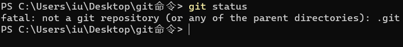

当前命令还不是Git仓库

git status 查看哪些文件被添加到缓存区了，不显示commit 后的文件。

#### git init

`git init `用于初始化仓库

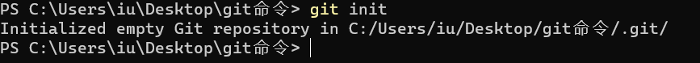

再次输入` git status`

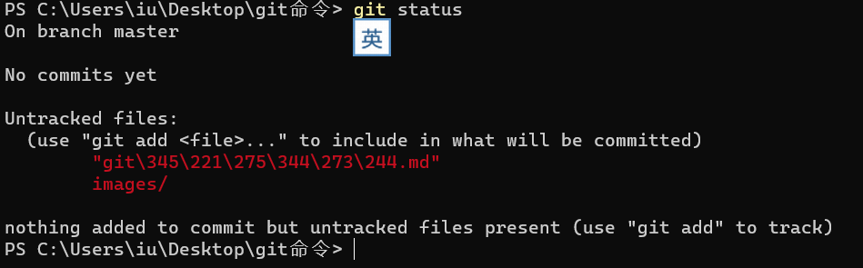

提示有红色文件还没被提交到git 仓库(这里指的是本地仓)

### git add

```bash
git add 文件名 【这是提交一个文件夹或文件】
git add .  【这是提交全部】
```


注意：`文件名字写英文把，乱码了... `

```bash
中文文件名乱码，要么改名字，要么 git add . 提交全部
git add . 
```

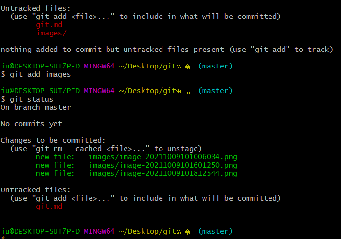


我改名了`当然乱码只是本地提交时，到仓库会好的，可以git add .全部提交` 只是注释只能写一条...

Changes to be committed 提示以下文件等待被提交

或者使用` git rm --cached 文件名  `  这个命令移除这个缓存


#### git commit

提交缓冲区所有文件

```bash
git commit -m "提交写的注释"
```

#### git log

git log 命令可以查看所有产生的 commit 记录， 而且提交时写的注释也在

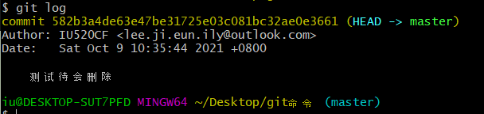


#### git add & git commit

git add 这步是把文件提交到暂存区，commit  是真正的提交，两部可合并，后面讲

----

#### git branch

branch 分支的意思

多人合作开发一个项目，一人开发一个模块，这时候每个人各建一个分支，提交自己的代码
互补影响，都做完后，再统一把分支合并起来。


执行git init 初始化仓库后 默认生成一个主分支 master,一般情况下master分支不会轻易直接在上面操作，可以输入 git branch 查看下 当前分支情况：

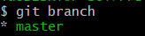

如果我们想在此基础上新建一个dev分支 

输入git branch 我们发现多了一个分支，但是当前分支还在master上

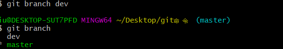

```bash
git checkout dev 
```

执行这个命令，然后输入git branch 查看分支情况：

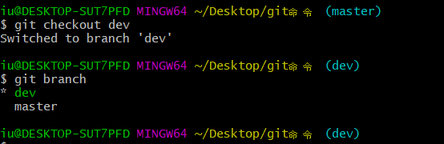

其实命令结尾蓝色括号已经给出当前分支了


**新建分支再切换好麻烦啊** `一步到位不好吗`

```bash
新建分支并切换到新分支
git checkout -b a
意思是：新建 a 分支 并且切换到 a 分支
```

----

#### git merge

合并分支

步骤：

1. 切换到 master分支

2. git merge a （意思是把 a分支 大代码合并过来）

3. 这里是最容易出现问题的地方，几个人同时改一个文件，就会提示出错手动合并（别自动哦，小心把同事代码整没了，俩人商量着来）

----

#### git branch -d 

删除分支

注意：先切换到主分支

```bash
git branch -d 分支名
```


假如这个分支新建错了，或者分支的代码已经顺利合并到master 分支了，那么a 分支没用了

需要删除，这个时候执行 git branch -d a 就可以把a 分支删除了。


#### git branch -D

强制删除分支

```bash
git branch -D 分支名
```

a 分支代码还没有合并到 master ，你执行 git branch -d a 是删除不了的 。特殊情况`分支新建还没动代码git branch -d 可以删`


#### git tag

版本

有个项目基本完成了，我们可以给它建个版本v1.0

```bash
git tag v1.0
```

项目升级了，给他新建个v2.0版本...


查看版本

```
git tag
```

切换tag版本

```bash
git checkout 版本号
git checkout v1.0
```


以上都是本地仓库命令,接下来学习如何提交的远程仓库

----

#### Push & pull

**push** ：意为是 "推" 的意思

```bash
git push origin master
```

意思就是把本地代码推到远程 master 分支。

pull: 意为"拉" 的意思，如果同事把代码提交到远程仓库，我们需要先拉pull 保证同步再提交。

```bash
git pull
```


### 提交代码

两种方式

方式一：简单

1.github新建仓库，复制仓库ssh地址

克隆仓库到本地"电脑任意位置"

```bash
git clone 仓库ssh地址
```

之后添加修改代码 提交

```bash
# 添加缓冲区
git add 文件 
# 提交本地仓 
git commit -m "注释"
# 多人合作先拉取
git pull
# 提交 【master 分支可忽略，默认提交master分支】
git push
```


方式二 ：难

假设：本地有一个多次commit 的仓库，我们想同步远程

1.新建远程仓库test[名随意]

2.本地仓库test2关联远程test

切换到test2目录

```pash
git remote add origin 远程仓库ssh地址
```

`origin` 是给这个项目的远程仓库起的名字，是的，名字你可以随便取，只不过大家公认的 

只有一个远程仓库时名字就是 origin 

接下来，我们本地的仓库就可以向远程仓库进行代码提交了： 

```bash
git push origin master
```


### Git 进阶

#### 1.用户名和邮箱

我们知道我们进行的每一次commit都会产生一条log，这条log标记了提交人的姓名与邮箱，以 

便其他人方便的查看与联系提交人，所以我们在进行提交代码的第一步就是要设置自己的用 

户名与邮箱。执行以下代码

```bash
git config --global user.name "stormzhang" 
git config --global user.email "stormzhang.dev@gmail.com"
```

以上进行了全局配置，当然有些时候我们的某一个项目想要用特定的邮箱，这个时候只需切 

换到你的项目，以上代码把 **--global** 参数去除，再重新执行一遍就ok了。

ps:提交了代码小绿格没绿，那是你配置的邮箱和github上的邮箱不一致，setting->Emails里查看更改


#### 2.alias

alias别名

```bash
git commit
git checkout
git branch
git status
...
```

对比

```bash
git c
git co
git br
git s
...
```

自定义别名

```bash
git config --global alias.co checkout # 别名 
git config --global alias.ci commit 
git config --global alias.st status 
git config --global alias.br branch
```

甚至可以设置组合

```bash
git config --global alias.psm 'push origin master' 
git config --global alias.plm 'pull origin master'
不过git push 和 git pull 默认都指向 origin master...只是能少写一丢丢... 有需求配别的
```


git log 查看日志 不够简洁


一次提交就这么长。。。

alias 配置一下,以后`git lg`

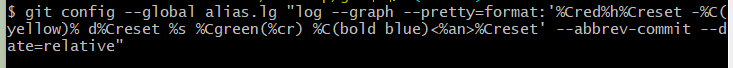

```bash
git config --global alias.lg "log --graph --pretty=format:'%Cred%h%Creset -%C(yellow)% d%Creset %s %Cgreen(%cr) %C(bold blue)<%an>%Creset' --abbrev-commit --date=relative"
```

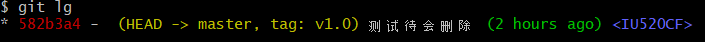


git bash 如果没有五颜六色，设置开启

```bash
git config --global color.ui true
```

显示中文文件名

```bash
git config --global core.quotepath false # 设置显示中文文件名
```

----


#### 4.diff

diff命令算是很常用的，使用场景是我们经常在做代码改动，但是有的时候2天前的代码了，做 

了哪些改动都忘记了，在提交之前需要确认下，这个时候就可以用diff来查看你到底做了哪些 

改动，举个例子，比如我有一个 git命令.md 的文件，我现在做了一些改动，然后输入 **git diff** 就会 

看到如下

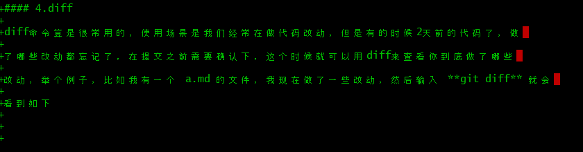


 看到我添加了这么多内容：绿色加好+ 是添加，红色- 号是删除

值得一提的是直接输入 **git diff** 只能比较当前文件和暂存区文件差异，什么是暂存区？就是你 

还没有执行 **git add** 的文件。 

```bash
git diff <$id1> <$id2> # 比较两次提交之间的差异 
git diff <branch1>..<branch2> # 在两个分支之间比较 
git diff --staged # 比较暂存区和版本库差异
```

----


#### 5.checkout

我们知道 **checkout** 一般用作切换分支使用，比如切换到 dev 分支，可以执行： 

```bash
git checkout dev
```

但是 **checkout** 不只用作切换分支，他可以用来切换tag，切换到某次commit，如:

```bash
git checkout v1.0 
git checkout ffd9f2dd68f1eb21d36cee50dbdd504e95d9c8f7 # 后面的一长串是commit_id，是每次com mit的SHA1值，可以根据 git log 看到。
```

除了有“切换”的意思，**checkout** 还有一个撤销的作用，举个例子，假设我们在一个分支开发 

一个小功能，刚写完一半，这时候需求变了，而且是大变化，之前写的代码完全用不了了， 

好在你刚写，甚至都没有 **git add** 进暂存区，这个时候很简单的一个操作就直接把原文件还 

原：

```bash
git checkout a.md
```

这里稍微提下，**checkout** 命令只能撤销还没有 add 进暂存区的文件。


#### 6.stash

设想一个场景，假设我们正在一个新的分支做新的功能，这个时候突然有一个紧急的bug需要 

修复，而且修复完之后需要立即发布。当然你说我先把刚写的一点代码进行提交不就行了 

么？这样理论上当然是ok的，但是这会产品垃圾commit，原则上我们每次的commit都要有实 

际的意义，你的代码只是刚写了一半，还没有什么实际的意义是不建议就这样commit的，那 

么有没有一种比较好的办法，可以让我暂时切到别的分支，修复完bug再切回来，而且代码也 

能保留的呢？ 

这个时候 **stash** 命令就大有用处了，前提是我们的代码没有进行 **commit** ，哪怕你执行了 

**add** 也没关系，我们先执行 

```bash
git stash
```


命令，什么意思呢？意思就是把当前分支所有没有 commit 的代码先暂存起来，这个时候你再 

执行 **git status** 你会发现当前分支很干净，几乎看不到任何改动，你的代码改动也看不见 

了，但其实是暂存起来了。执行 

```bash
git stash list
```

你会发现此时暂存区已经有了一条记录。 

这个时候你可以切换会其他分支，赶紧把bug修复好，然后发布。之后一切都解决了，你再切 

换回来继续做你之前没做完的功能，但是之前的代码怎么还原呢？ 

```bash
git stash apply
```

你会发现你之前的代码全部又回来了，就好像一切都没发生过一样，紧接着你最好需要把暂 

存区的这次 **stash** 记录删除，执行：

```bash
git stash drop
```

就把最近一条的 **stash** 记录删除了，是不是很方便？其实还有更方便的，你可以使用： 

```bash
git stash pop
```

来代替 **apply** 命令，**pop** 跟 **apply** 的唯一区别就是 **pop** 不但会帮你把代码还原，还自动帮你 

把这条 **stash** 记录删除，省的自己再 **drop** 一次了，为了验证你可以紧接着执行 **git stash** 

**list** 命令来确认是不是已经没有记录了。


最后还有一个命令介绍下：

```bash
git stash clear
```

就是清空所有暂存区的记录，**drop** 是只删除一条，当然后面可以跟 **stash_id** 参数来删除指 

定的某条记录，不跟参数就是删除最近的，而 **clear** 是清空。 


#### 7.merge & rebase

merge 和 rebase都是合并分支的意思

```bash
git checkout master 
git merge featureA
```


```bash
git checkout master 
git rebase featureA
```

**rebase** 跟 **merge** 的区别你们可以理解成有两个书架，你需要把两个书架的书整理到一起 

去

，第一种做法是 **merge** ，比较粗鲁暴力，就直接腾出一块地方把另一个书架的书全部放进 

去

，虽然暴力，但是这种做法你可以知道哪些书是来自另一个书架的；第二种做法就是 

**rebase** ，他会把两个书架的书先进行比较，按照购书的时间来给他重新排序，然后重新放置 

好，这样做的好处就是合并之后的书架看起来很有逻辑，但是你很难清晰的知道哪些书来自 

哪个书架的。 

只能说各有好处的，不同的团队根据不同的需要以及不同的习惯来选择就好。

----


#### 8.解决冲突

假设这样一个场景，A和B两位同学各自开了两个分支来开发不同的功能，大部分情况下都会 

尽量互不干扰的，但是有一个需求A需要改动一个基础库中的一个类的方法，不巧B这个时候 

由于业务需要也改动了基础库的这个方法，因为这种情况比较特殊，A和B都认为不会对地方 

造成影响，等两人各自把功能做完了，需要合并的到主分支 master 的时候，我们假设先合并 

A的分支，这个时候没问题的，之后再继续合并B的分支，这个时候想想也知道就有冲突了， 

因为A和B两个人同时更改了同一个地方，Git 本身他没法判断你们两个谁更改的对，但是这个 

时候他会智能的提示有 **conflicts** ，需要手动解决这个冲突之后再重新进行一次 commit 提 

交。我随便在项目搞了一个冲突做下示例： 


我们在开发的过程中一般都会约定尽量大家写的代码不要彼此影响，以减少出现冲突的可 

能，但是冲突总归无法避免的，我们需要了解并掌握解决冲突的方法


### 团队合作利器：**Git** 分支管理

* 新建一个叫 develop 的分支 

```bash
git branch develop
```

`这里稍微提醒下大家，新建分支的命令是基于当前所在分支的基础上进行的，即以上是基于mater 分支新建了一个叫做 develop 的分支，此时 develop 分支跟 master 分支的内容完全一 样。如果你有 A、B、C三个分支，三个分支是三位同学的，各分支内容不一样，如果你当前 是在 B 分支，如果执行新建分支命令，则新建的分支内容跟 B 分支是一样的，同理如果当前 所在是 C 分支，那就是基于 C 分支基础上新建的分支。 `

* 切换到 develop 分支 

```bash
git checkout develop
```

* 合并两步操作，创建并切换

```bash
git branch -b develop
```


* 把develop 分支推送到远程仓库

```bash
git push origin develop
```

* 如果你远程的分支想取名叫 develop2 ，那执行以下代码：

```bash
git push origin develop:develop2
```

**注意**：`但是强烈不建议这样，这会导致很混乱，很难管理，所以建议本地分支跟远程分支名要保持 一致。`


* 查看本地分支列表

```bash
git branch
```

* 查看远程分支列表

```bash
git branch -r
```

* 删除本地分支

```bash
git branch -d develop
git branch -D develop(强制删除)
```

* 删除远程分支

```bash
git push origin :develop
```

* 远程分支有个develop,而本地没有，你想把远程分支develop迁移到本地

```bash
git checkout develop origin/develop
```

* 远程分支迁移本地并切换到该分支

```bash
git checkout -b develop origin/develop
```

---

### 3.基本的团队协作流程

`一般来说，如果你是一个人开发，可能只需要 master、develop 两个分支就 ok 了，平时开发 在 develop 分支进行，开发完成之后，发布之前合并到 master 分支，这个流程没啥大问题`。

` 如果你是 3、5 个人，那就不一样了，有人说也没多大问题啊，直接可以新建 A、B、C 三个 人的分支啊，每人各自开发各自的分支，然后开发完成之后再逐步合并到 master 分支。然而 现实却是，你正在某个分支开发某个功能呢，这时候突然发现线上有一个很严重的 bug ，不 得不停下手头的工作优先处理 bug ，而且很多时候多人协作下如果没有一个规范，很容易产 生问题，所以多人协作下的分支管理规范很重要，就跟代码规范一样重要，以下就跟大家推 荐一种我们内部在使用的一种分支管理流程 Git low`。 

#### 4.Git Flow

准确的说 Git Flow 是一种比较成熟的分支管理流程，我们先看一张图能清晰的描述他整个的 

工作流程： 

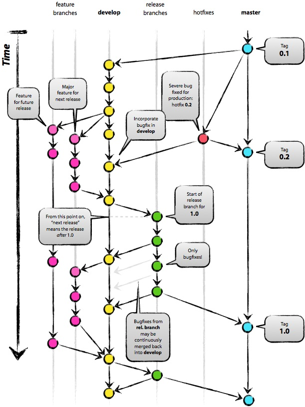

一般开发来说，大部分情况下都会拥有两个分支 master 和 develop，他们的职责分别是： 

* master：永远处在即将发布(production-ready)状态 

* develop：最新的开发状态 

确切的说 master、develop 分支大部分情况下都会保持一致，只有在上线前的测试阶段 

develop 比 master 的代码要多，一旦测试没问题，准备发布了，这时候会将 develop 合并到 

master 上


但是我们发布之后又会进行下一版本的功能开发，开发中间可能又会遇到需要紧急修复 bug 

，一个功能开发完成之后突然需求变动了等情况，所以 Git Flow 除了以上 master 和 develop 

两个主要分支以外，还提出了以下三个辅助分支： 

* feature: 开发新功能的分支, 基于 develop, 完成后 merge 回 develop 

* release: 准备要发布版本的分支, 用来修复 bug，基于 develop，完成后 merge 回 develop 和 master 

* hotfix: 修复 master 上的问题, 等不及 release 版本就必须马上上线. 基于 master, 完成后 merge 回 master 和 develop 

什么意思呢？ 

举个例子，假设我们已经有 master 和 develop 两个分支了，这个时候我们准备做一个功能 

A，第一步我们要做的，就是基于 develop 分支新建个分支

```bash
git branch feature/A
```

看到了吧，其实就是一个规范，规定了所有开发的功能分支都以 feature 为前缀。 

但是这个时候做着做着发现线上有一个紧急的 bug 需要修复，那赶紧停下手头的工作，立刻 

切换到 master 分支，然后再此基础上新建一个分支： 

```bash
git branch hotfix/B
```

代表新建了一个紧急修复分支，修复完成之后直接合并到 develop 和 master ，然后发布。 

然后再切回我们的 feature/A 分支继续着我们的开发，如果开发完了，那么合并回 develop 分 

支，然后在 develop 分支属于测试环境，跟后端对接并且测试的差不多了，感觉可以发布到 

正式环境了，这个时候再新建一个 release 分支：

```bash
git branch release/1.0
```

`这个时候所有的 api、数据等都是正式环境，然后在这个分支上进行最后的测试，发现 bug 直接进行修改，直到测试 ok 达到了发布的标准，最后把该分支合并到 develop 和 master 然后 进行发布。 `

以上就是 Git Flow 的概念与大概流程，看起来很复杂，但是对于人数比较多的团队协作现实 

开发中确实会遇到这么复杂的情况，是目前很流行的一套分支管理流程，但是有人会问每次 

都要各种操作，合并来合并去，有点麻烦，哈哈，这点 Git Flow 早就想到了，为此还专门推 

出了一个 Git Flow 的工具，并且是开源的：


**GitHub** 开源地址：https://github.com/nvie/gitflow 


简单点来说，就是这个工具帮我们省下了很多步骤，比如我们当前处于 master 分支，如果想 

要开发一个新的功能，第一步切换到 develop 分支，第二步新建一个以 feature 开头的分支 

名，有了 Git Flow 直接如下操作完成了： 

```bash
git flow feature start A
```


这个分支完成之后，需要合并到 develop 分支，然而直接进行如下操作就行： 

```bash
git flow feature finish A
```

如果是 hotfix 或者 release 分支甚至会自动帮你合并到 develop、master 两个分支。 


### **GitHub** 常见的几种操作 

我们都说开源社区最大的魅力是人人多可以参与进去，发挥众人的力量，让一个项目更完 

善，更强壮。那么肯定有人疑问，我自己目前还没有能力开源一个项目，但是想一起参与到 

别的开源项目中，该怎么操作呢？那么今天，就来给大家一起介绍下 GitHub 上的一些常见的 

操作，看完之后你就知道方法了。 

* Code  :这个好理解，就是你项目的代码文件而已

* lssues:代表该项目的一些问题或者 bug，并不是说 Issues 越少越好，Issues 被解决的越多说 明项目作者或者组织响应很积极，也说明该开源项目的作者很重视该项目.同样的，大家在使用一些开源项目有问题的时候都可以提 Issue，可以通过点击右上角的 New Issue 来新建 Issue，需要添加一个标题与描述就可以了，这个操作很简单。 

* Pull requests :**第一步**登录你的 GitHub 账号，然后找到你想发起 PR 的项目，点击右 上角的 Fork 按钮，然后该项目就出现在了你自己账号的 Repository 里。`可以看到 Fork 过来的项目标题底部会显示一行小字：fork from stormzhang/9GAG ，除此之 外，项目代码跟原项目一模一样，对于原项目来说，相当于别人新建了一个分支而已。 ` **第二步**，把该项目 clone 到本地，然后修改的 bug 也好，想要新增的功能也好，总之把自己 做的代码改动开发完，保存好。接着，把自己做的代码改动 push 到 你自己的 GitHub 上去。**第三步**，点击你 Fork 过来的项目主页的 Pull requests 页面，点击 New pull request ，这个页面自动会比较该项目master 分支与原有项目的master 分支所做的比较。同样的我写好标题和描述，然后我们点击中间的 Create pull request 按钮，至此我们就成功 

  给该项目提交了一个 PR。***然后就等着项目原作者 review 你的代码，并且决定会不会接受你的 PR，如果接受，那么恭 喜你，你已经是该项目的贡献者之一了。***

----

剩余功能不重要完结

文档:参考从零开始学习GitHub系列.pdf

 