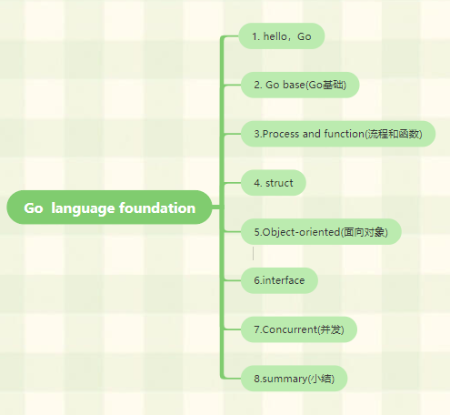

### 02 GO 语言基础

#### 02.0 GO语言基础

Go是一门简单的语言，且性能不俗。

一共25个关键字(比英文字母还少一个)：

```bash
break		default		func	interface	select
case		defer		go		map			struct
chan		else		goto	package		switch
const		fallthrough	if		range		type
continue	for			import	return		var
```




#### 02.1 你好，GO

```go
// package当前文件属于 哪个包
package main
// 引入 fmt系统包
import "fmt"
func main() {
	//fmt包调用Println方法在控制台打印
	fmt.Println("Hello, world or 你好，世界 or καλημ ́ρα κóσμ or こんにちはせかい\\n")
}
//打印结果: Hello, world or 你好，世界 or καλημ ́ρα κóσμ or こんにちはせかい\n
```

Go使用UTF-8字符串和标识符(因为UTF-8的发明者就是 Go的发明者之一)，所以天生支持多语言。

#### 02.2 GO基础

##### 定义变量

语法：

```go
var 变量名 类型
// 例:
var varname type

```

定义变量并初始化值

```go
var 变量名 类型 = 值
var varname type = value
```

定义同类型的多个变量，并分别初始化相应的值

```go
var vname1,vname2,vname3 type = v1,v2,v3
```

忽略类型声明

```go
var vname1,vname2,vname3 = v1,v2,v3
/*
go 会根据值的类型来帮助他们初始化
*/
```

还是有点多

```go
vname1,vname2,vname3 := v1, v2, v3
```

**注意**：`:=` 符号直接取代了 var 和 type。只能用在函数内部；函数外部不能通过编译，一般用`var` 用来定义全局变量

注意：Go 对已声明但未使用的变量会在编译阶段报错(垃圾回收机制，就说明go对垃圾不容忍，容易理解)


##### 常量

所谓常量，就是不改变的值，就像身份证号，是不可变的。程序在运行时无法改变的值。

Go中：常量可定义为数值、布尔值、字符串等类型。

**语法**：

```go
const constName = value
// 如有需要，可以明确指定常量的类型
const Pi float32 = 3.1415926
```

Go 常量和一般程序语言不同的是，可以指定相当多的小数位数 (例如 200 位)，
若指定给 float32 自动缩短为 32bit，指定给 float64 自动缩短为 64bit，

##### 内置基础类型

----

###### Boolean

在 Go中，布尔值的类型为 `bool`,值是`true`或`false` ,默认为 `false`。

```go
	bln := false // 函数内部这样写
	fmt.Println(bln)
```


##### 数值类型

##### 字符串

Go 中的字符串都是采用 `UTF-8` 字符集编码。字符串是用一对双引号（`""`）或反引号（``` ```）括起来定义，它的类型是 `string`。

在 Go 中字符串是不可变的，但如果真的想要修改怎么办呢？下面的代码可以实现

```go
	ss := "hello"
	c := []byte(ss)//转byte
	c[0] = 'c'
	fmt.Println(c)//[99 101 108 108 111] 数组中数字存储
	s2 := string(c)//转string
	fmt.Printf("%s\n",s2)//cello
```


Go 中可以使用 `+` 操作符来连接两个字符串：

```GO
	s := "hello,"
	m := "world"
	a := s + m
	fmt.Printf("%s\n",a)
```


##### 错误类型

##### Go 数据底层的存储

##### 一些技巧

##### 分组声明

##### iota 枚举

##### Go程序设计的一些规则

##### array、slice、map

###### array

###### slice

###### map

##### make、new操作

##### 零值


#### 02.3 流程和函数


#### 02.4 struct 类型


#### 02.5 面向对象


#### 02.6 interface


#### 02.7 并发


#### 02.8 总结