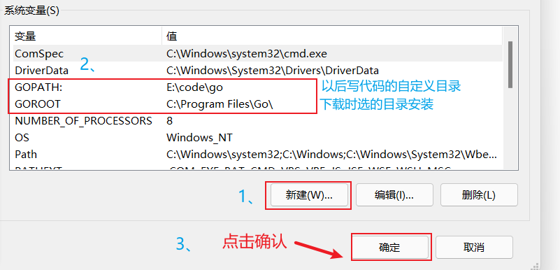
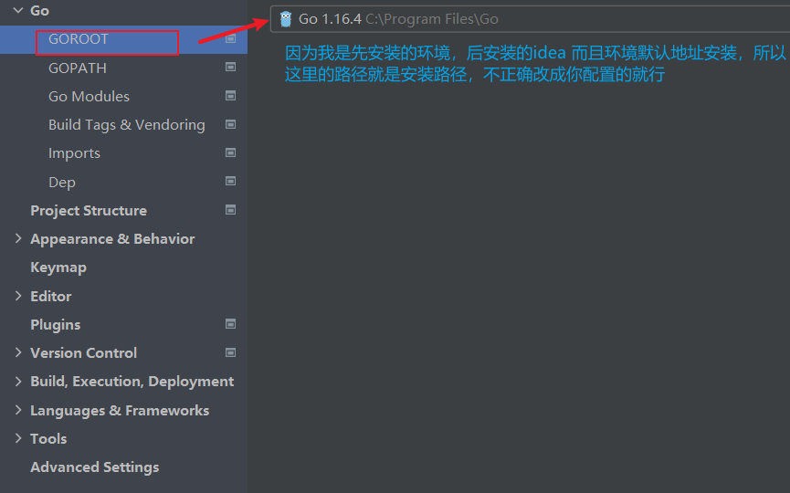
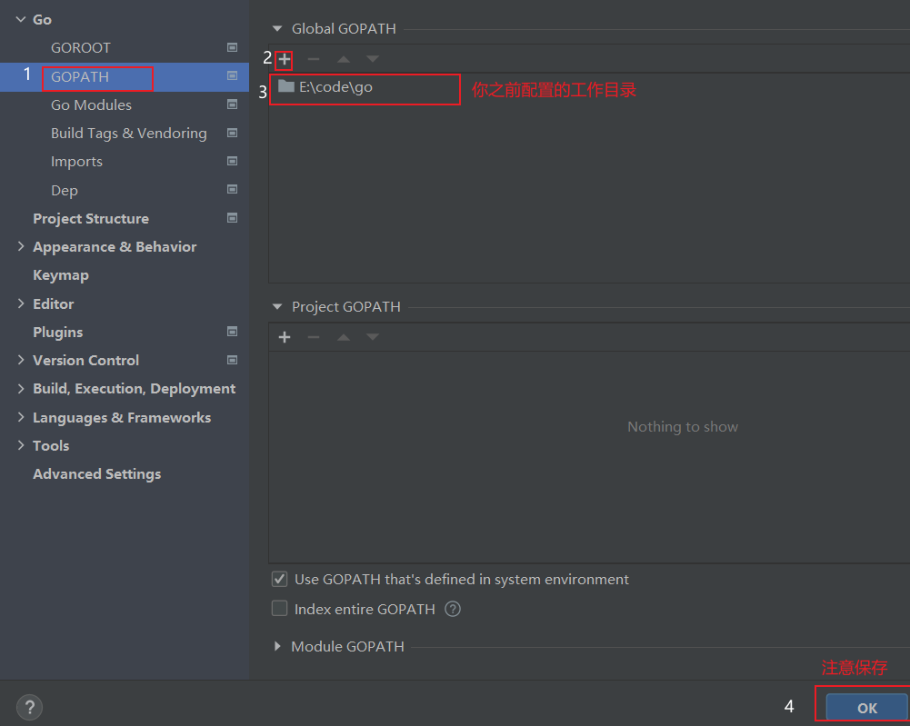
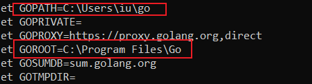

官网下载安装golong 环境

注意：安装勾选path 环境

手动添加 GOPATH 环境 和GOROOT 环境

GOPATH：定义开发目录，只有一个意思是go只有一个开发目录 `在新版本中会自动添加到用户里面建议删除，添加自定义位置到全局配置内`

GOROOT 是安装golong目录



**注意**： 用户环境的GOPATH 要删除不然可能会报错【毕竟当前用户在使用】

官网下载安装goland 编译器

试用或激活或买正版

打开目录你配置的工作目录(GOPATH目录)

goland 配置

file -----settings...

GOPATH



GOROOT



随意位置打开`cmd`

```powershell
go env
```



-----

配置完成