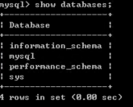
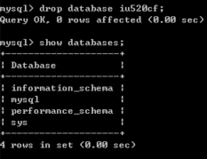

### `mysql` basic command exercise

环境简述：

1. 腾讯云学生轻量应用服务器 

				   2. 系统版本：windows Server 2012 R2      64位
   
      				   3. `mysql`版本：5.7.35.0 （这个大版本一样就行，前两项忽略）

#### 连接数据库

打开MySQL 5.7 Command Line Client (或者命令行)

```sql
-- 打开 MySQL 5.7 Command Line Client （也就是mysql安装后自动命令窗口）
-- 直接输入安装时设置的mysql密码

-- 当然你也可以 在cmd 连接 mysql 进行操作 （练习基础命名，在哪都一样，因为以后在代码里连接数据库操作）
-- mysql -u root -p (本地操作) 【要先添加系统环境，如果还有运行脚本,也弄一下】
```


#### 查看数据库

```sql
show databases; # 因为数据库是多个，database要加s
```



* 我们看到mysql database 自带四个 数据库 分别是：`information_schena` 、`mysql` 、`perfornance_schena` 、`sys`  
* 注意：系统自带数据库不能删除，创建别的数据库操作

#### 创建数据库

```sql
create database 数据库名
```


我们发现：我明明是要创建 IU520CF,结果创建出来后是 iu520cf

* 注意：mysql 不区分大小写

1. **数据库存中文如果表没设置编码格式mysql默认格式乱码**  数据库指定编码格式后，当前数据库内的表默认该编码格式，创建表时可设置当前表编码格式
2. 创建数据库并指定utf8编码格式 （**推荐使用**）

```sql
CREATE DATABASE db_ios CHARACTER SET utf8 COLLATE utf8_general_ci;
-- or 这俩一样
CREATE DATABASE IF NOT EXISTS db_name DEFAULT CHARSET utf8;
```


#### 删除数据库

```sql
-- 删除 数据库  数据库名
drop database iu520cf
```



#### 选择数据库

```sql
use 数据库名
use iu520cf
```


#### 查看数据库表

我们刚创建的数据库是空的

```sql
-- 查看数据库表
show tables;
```


数据库是空的，我们肯定要给它添加点东西，`mysql`存数据都是用数据库表存的，所以我们学习如何创建表

创建表之前我们先了解一下数据类型，它用来创建数据库表的约束

#### 数据类型

##### 数值类型

| 类型         | 大小                                     | 范围（有符号）                                               | 范围（无符号）                                               | 用途            |
| ------------ | ---------------------------------------- | ------------------------------------------------------------ | ------------------------------------------------------------ | --------------- |
| TINYINT      | 1 Bytes                                  | (-128，127)                                                  | (0，255)                                                     | 小整数值        |
| SMALLINT     | 2 Bytes                                  | (-32 768，32 767)                                            | (0，65 535)                                                  | 大整数值        |
| MEDIUMINT    | 3  Bytes                                 | (-8 388 608，8 388 607)                                      | (0，16 777 215)                                              | 大整数值        |
| INT或INTEGER | 4  Bytes                                 | (-2 147 483 648，2 147 483 647)                              | (0，4 294 967 295)                                           | 大整数值        |
| BIGINT       | 8  Bytes                                 | (-9,223,372,036,854,775,808，9 223 372 036 854 775 807)      | (0，18 446 744 073 709 551 615)                              | 极大整数值      |
| FLOAT        | 4  Bytes                                 | (-3.402 823 466 E+38，-1.175 494 351 E-38)，0，(1.175 494 351 E-38，3.402 823 466 351 E+38) | 0，(1.175 494 351 E-38，3.402 823 466 E+38)                  | 单精度 浮点数值 |
| DOUBLE       | 8  Bytes                                 | (-1.797 693 134 862 315 7 E+308，-2.225 073 858 507 201 4 E-308)，0，(2.225 073 858 507 201 4 E-308，1.797 693 134 862 315 7 E+308) | 0，(2.225 073 858 507 201 4 E-308，1.797 693 134 862 315 7 E+308) | 双精度 浮点数值 |
| DECIMAL      | 对DECIMAL(M,D) ，如果M>D，为M+2否则为D+2 | 依赖于M和D的值                                               | 依赖于M和D的值                                               | 小数值          |

##### 日期时间类型

| 类型      | 大小 ( bytes) | 范围                                                         | 格式                | 用途                     |
| --------- | ------------- | ------------------------------------------------------------ | ------------------- | ------------------------ |
| DATE      | 3             | 1000-01-01/9999-12-31                                        | YYYY-MM-DD          | 日期值                   |
| TIME      | 3             | '-838:59:59'/'838:59:59'                                     | HH:MM:SS            | 时间值或持续时间         |
| YEAR      | 1             | 1901/2155                                                    | YYYY                | 年份值                   |
| DATETIME  | 8             | 1000-01-01 00:00:00/9999-12-31 23:59:59                      | YYYY-MM-DD HH:MM:SS | 混合日期和时间值         |
| TIMESTAMP | 4             | 1970-01-01 00:00:00/2038 结束时间是第 **2147483647** 秒，北京时间 **2038-1-19 11:14:07**，格林尼治时间 2038年1月19日 凌晨 03:14:07 | YYYYMMDD HHMMSS     | 混合日期和时间值，时间戳 |

##### 字符串类型

| 类型       | 大小                  | 用途                            |
| ---------- | --------------------- | ------------------------------- |
| CHAR       | 0-255 bytes           | 定长字符串                      |
| VARCHAR    | 0-65535 bytes         | 变长字符串                      |
| TINYBLOB   | 0-255 bytes           | 不超过 255 个字符的二进制字符串 |
| TINYTEXT   | 0-255 bytes           | 短文本字符串                    |
| BLOB       | 0-65 535 bytes        | 二进制形式的长文本数据          |
| TEXT       | 0-65 535 bytes        | 长文本数据                      |
| MEDIUMBLOB | 0-16 777 215 bytes    | 二进制形式的中等长度文本数据    |
| MEDIUMTEXT | 0-16 777 215 bytes    | 中等长度文本数据                |
| LONGBLOB   | 0-4 294 967 295 bytes | 二进制形式的极大文本数据        |
| LONGTEXT   | 0-4 294 967 295 bytes | 极大文本数据                    |

#### 创建数据库表

```sql
-- 语法
CREATE TABLE table_name (column_name column_type)ENGINE=InnoDB DEFAULT CHARSET=utf8;
```

```sql
-- 实例
create table tab_name(
	tab_id int not null auto_increment,
    tab_title varchar(100) not null,
    tab_happy varchar(40) not null
    submission_date date,
    primary key(tab_id)
)engine = InnoDB DEFAULT charset=utf8;

```


#### 删除数据库表

